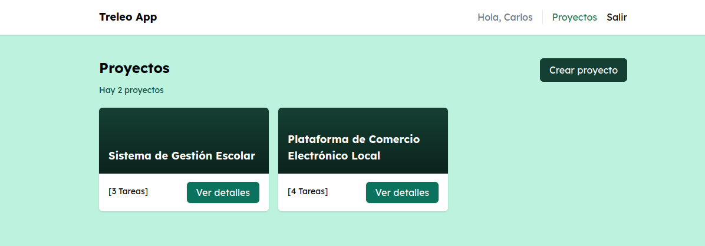

# Treleo App
Reto técnico Fullstack Typescript

## Descripción
Este repositorio contiene dos aplicaciones, una llamada backend y la otra frontend. Backend es una API realizada con Adonis `NodeJS`. Frontend es la interface de usuario realizada con Angular. Siga las siguientes instrucciones para desplegar las aplicaciones en su entorno local:

## Requisitos
- NodeJS version 18
- npm o yarn
- Base de datos MariaDB | MySQL

## Instrucciones Iniciales
1. Clone el repositorio en su computadora usando git o descargue el repositorio directamente desde su navegador.
2. Si es que descargó el repositorio, descomprima el archivo. De lo contrario pase al siguiente paso.
3. Dentro encontrará 2 directorios: frontend y backend.
4. Desde la terminal, ingrese a backend y ejecute `yarn` o `npm install` lo mismo hará con frontend. Esto instalará las dependencias de cada aplicación.

## Levantando el Backend
1. Antes de lavantar el servidor, cree una base de datos llamada `treleo`.
2. Renombre el archivo `.env.example` a `.env`.
3. Ingrese desde la terminal a la raíz del proyecto backend.
4. Ejecuta las migraciones de la aplicación para crear las tablas con el siguiente comando: `node ace migration:run`.
5. Ejecute los seeders para cargar la información inicial a las tablas con el siguiente comando: `node ace db:seed`.
6. Ejecute el siguiente comando para levantar el servidor de desarrollo: `node ace serve`. El comando anterior iniciará el servidor y se desplegará en la siguiente dirección por defecto: `http://127.0.0.1:3333`

## Levantando el Frontend
1. Desde la terminal, ingrese al frontend y ejecute el siguiente comando para levantar la aplicación de Angular: `ng serve`. El comando anterior iniciará el servidor y se desplegará en la siguiente dirección por defecto: `http://localhost:4200`.

## Uso del Demo
Por defecto, cuando se ejecutan los seeders, se crean los registros de prueba. Un usuario de prueba llamado: `demo@delfosti.com`. Su contraseña por defecto es: `xyz123456`. Además algunos proyectos con sus tareas.